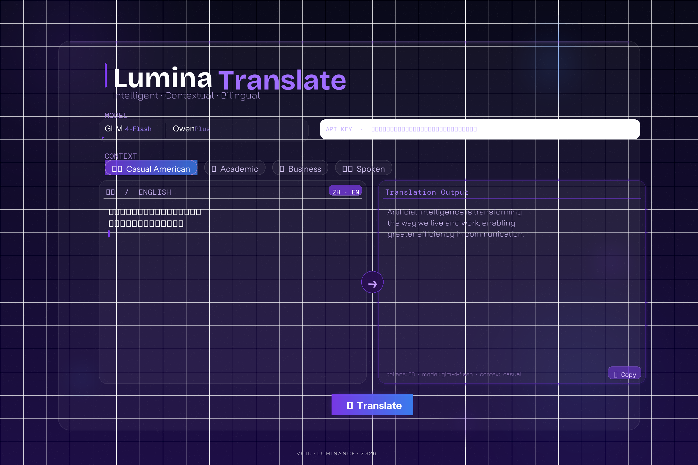

# XTranslator

一个基于 HTML + Python 的轻量级中英互译工具，支持多语境、多模型，界面简洁清爽。



---

## 功能特性

- **自动语言检测** — 输入中文自动翻译成英文，输入英文自动翻译成中文
- **4 种语境模式** — 美国生活化 / 学术派 / 商务专业 / 口语日常，通过 Prompt 控制翻译风格
- **双模型支持** — GLM（glm-4-flash / glm-4-air / glm-4）和 Qwen（qwen-turbo / qwen-plus / qwen-max）
- **API Key 持久化** — 使用 `localStorage` 保存，刷新页面不丢失
- **本地代理服务器** — 绕过浏览器 CORS 限制，直接调用 API
- **快捷键** — `Cmd + Enter`（Mac）/ `Ctrl + Enter`（Windows）快速翻译

---

## 快速开始

### 1. 克隆仓库

```bash
git clone https://github.com/darkrainli/XTranstlator.git
cd XTranstlator
```

### 2. 启动本地服务器

```bash
./start.sh
```

或者直接运行：

```bash
python3 server.py
```

### 3. 打开浏览器访问

```
http://localhost:8765/translator.html
```

> **注意**：必须通过 `localhost` 访问，直接双击 HTML 文件会因浏览器 CORS 策略导致 API 请求失败。

---

## 获取 API Key

| 模型 | 平台 | 获取地址 |
|------|------|---------|
| GLM  | 智谱 AI | https://open.bigmodel.cn |
| Qwen | 阿里云百炼 | https://bailian.console.aliyun.com |

---

## 项目结构

```
XTranslator/
├── translator.html   # 前端页面（单文件，含所有 CSS 和 JS）
├── server.py         # 本地代理服务器（Python 3，无需安装依赖）
├── start.sh          # 一键启动脚本
└── README.md
```

---

## 技术栈

- **前端** — 纯 HTML / CSS / JavaScript，无框架，无依赖
- **后端** — Python 3 标准库（`http.server` + `urllib`），零依赖
- **API** — OpenAI 兼容格式，同时支持智谱 GLM 和阿里 Qwen

---

## 环境要求

- Python 3.6+
- 现代浏览器（Chrome / Safari / Firefox / Edge）
